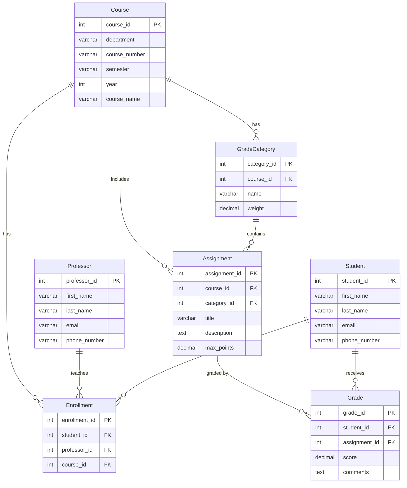

# Task 1: ER Diagram — GradeBook Database

This document describes the Entity-Relationship (ER) diagram for the GradeBook Database. The diagram is represented below using a Mermaid ERD, which GitHub renders visually.

## Entity Descriptions

| Entity | Description |
|---|---|
| **Student** | A student enrolled at the university |
| **Professor** | A professor who teaches courses |
| **Course** | A course offered by a department in a given semester/year |
| **Enrollment** | Links a student and professor to a course (many-to-many bridge) |
| **GradeCategory** | A grading category for a course (e.g., Homework 20%, Tests 50%) |
| **Assignment** | An individual assignment belonging to a category within a course |
| **Grade** | A student's score on a specific assignment |

## Relationships

- A **Student** can enroll in many **Courses** (via Enrollment)
- A **Professor** teaches many **Courses** (via Enrollment)
- A **Course** has many **GradeCategories** (weights must sum to 100%)
- A **GradeCategory** has many **Assignments**
- A **Student** receives many **Grades** (one per Assignment)

## Mermaid ER Diagram

## Key Constraints

- **Primary Keys (PK):** Each table has a unique integer primary key.
- **Foreign Keys (FK):** Enforce referential integrity between related tables.
- **GradeCategory.weight:** All weights per course must sum to **100%**.
- **Grade.score:** Can be NULL if the assignment has not been submitted yet.
- **Assignment.max_points:** Default is 100.00; allows partial-credit scaling.
